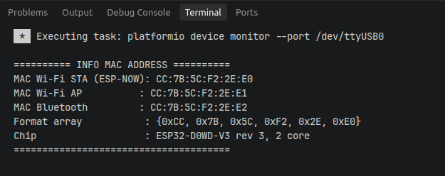
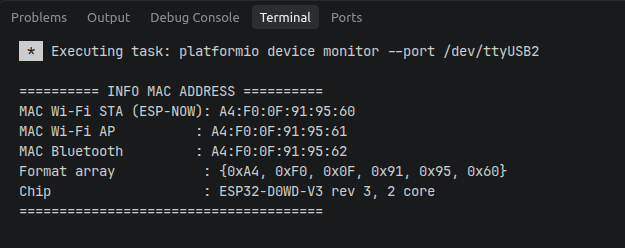
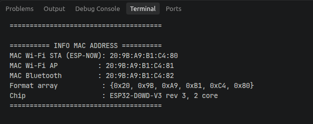
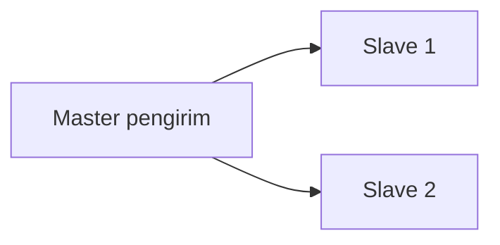
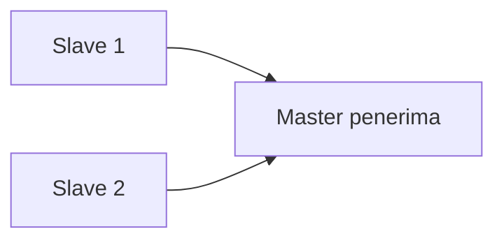
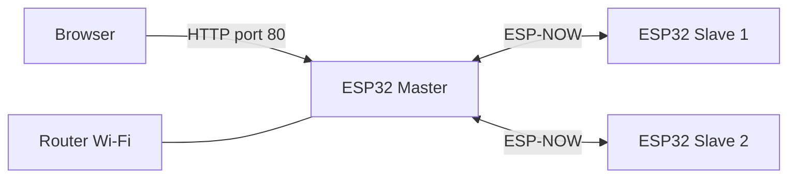

# Praktikum 3 : Wireless Sensor Network Short Range (ESP-NOW)


Repositori ini berisi kumpulan program praktikum **komunikasi nirkabel jarak dekat antar ESP32 menggunakan ESP-NOW**. Praktikum dimulai dari langkah paling dasar (mengecek MAC address), lalu berlanjut ke berbagai pola komunikasi: **Two Ways (PtP)**, **One to Many**, **Many to One**, **Mesh**, dan **ESP-NOW + Web Server**.

Semua komunikasi dilakukan **tanpa router dan tanpa internet** (kecuali pada bagian web server, yang memakai Wi-Fi hanya untuk menampilkan halaman web). Pesan diketik melalui **Serial Monitor**, dikirim lewat udara, lalu ditampilkan di Serial Monitor perangkat lain.

Program dapat dibuka, dikompilasi, dan diunggah memakai **Arduino IDE** maupun **PlatformIO** (VS Code atau command line).

---

## Apa itu ESP-NOW?

**ESP-NOW** adalah protokol komunikasi nirkabel buatan **Espressif** yang memungkinkan beberapa ESP32 saling berkirim data **secara langsung (peer-to-peer)** melalui radio 2,4 GHz. Tidak ada proses *connect* ke access point, tidak ada DHCP, dan tidak ada handshake yang panjang. Perangkat cukup mengetahui **MAC address** lawan bicaranya, lalu langsung mengirim data.

### Perbandingan dengan Wi-Fi biasa

| Aspek | Wi-Fi biasa (TCP/IP) | ESP-NOW |
|---|---|---|
| Butuh router / access point | Ya | **Tidak** |
| Proses koneksi (scan, autentikasi, DHCP) | Ya, memakan waktu | **Tidak ada** (*connectionless*) |
| Latensi | Relatif lebih tinggi | **Rendah** |
| Ukuran data per paket | Besar | **Maksimal 250 byte** |
| Jumlah peer | Banyak klien per router | Hingga 20 peer per perangkat (maksimal 10 bila terenkripsi) |
| Cocok untuk | Web, internet, streaming | Sensor, remote control, pesan singkat antar-board |

### Mengapa cocok untuk Wireless Sensor Network?

- **Hemat daya dan cepat**: tanpa proses koneksi, data bisa langsung dikirim.
- **Mandiri**: jaringan tetap bekerja walau tidak ada router atau internet.
- **Sederhana**: cukup beberapa fungsi API untuk mengirim dan menerima data.
- **Fleksibel**: bisa membentuk pola satu-ke-satu, satu-ke-banyak, banyak-ke-satu, hingga mesh.

### Istilah penting

| Istilah | Penjelasan |
|---|---|
| **MAC address** | Alamat unik 6 byte milik setiap board, contoh `CC:7B:5C:F2:2E:E0`. Dipakai ESP-NOW sebagai "alamat tujuan", mirip nomor telepon. |
| **Peer** | Perangkat lawan bicara yang **didaftarkan** terlebih dulu sebelum kita boleh mengirim data ke MAC-nya. |
| **Callback** | Fungsi yang **dipanggil otomatis** oleh sistem saat suatu kejadian terjadi (data selesai dikirim atau data masuk). |
| **Unicast** | Mengirim ke **satu** MAC tertentu. |
| **Broadcast** | Mengirim ke **semua** perangkat di sekitar memakai MAC `FF:FF:FF:FF:FF:FF`. |
| **Payload** | Isi data yang dikirim. Di praktikum ini berupa `struct` yang berisi teks. |
| **Channel** | Kanal frekuensi Wi-Fi. Perangkat yang saling berkomunikasi harus berada di channel yang sama. |

---

## Kebutuhan Perangkat dan Software

**Perangkat keras**

- 3 buah ESP32 (pada praktikum ini diberi peran **Master**, **Slave 1**, dan **Slave 2**)
- Kabel USB data
- Laptop/PC (idealnya bisa membuka beberapa Serial Monitor sekaligus)

**Perangkat lunak**

- Sistem operasi **Ubuntu Linux** (contoh pada dokumen ini)
- **Pilih salah satu** lingkungan pengembangan:
  - **PlatformIO** (dipakai penulis): [Visual Studio Code](https://code.visualstudio.com/) dengan ekstensi **PlatformIO IDE** (sudah termasuk PlatformIO Core, platform `espressif32` akan terunduh otomatis saat build pertama), atau
  - **Arduino IDE** 2.x
- Driver USB-serial (CP210x atau CH340, sesuai board). Di Ubuntu, driver ini umumnya sudah ada di kernel sehingga tidak perlu instalasi tambahan.

> Tidak ada library tambahan yang perlu diinstal (`lib_deps` tidak diperlukan). `WiFi.h`, `esp_now.h`, `WebServer.h`, dan `ESPmDNS.h` sudah termasuk dalam framework Arduino-ESP32.

### PlatformIO atau Arduino IDE?

Keduanya menghasilkan program yang sama untuk ESP32, sehingga kode di repositori ini bisa dipakai di salah satunya. Perbedaannya ada pada cara kerja dan struktur proyek:

| Aspek | PlatformIO | Arduino IDE |
|---|---|---|
| Format file | `src/main.cpp` (atau `main.ino`) dan `platformio.ini` | `.ino` dalam folder bernama sama |
| Pengaturan board dan port | Ditulis di `platformio.ini` | Menu **Tools** |
| Board package dan library | Diunduh otomatis sesuai `platformio.ini` | Diinstal lewat Boards Manager |
| Serial Monitor | `pio device monitor` atau ikon steker di VS Code | Bawaan IDE |
| Beberapa board sekaligus | Satu `[env]` per board di `platformio.ini` | Pilih board dan port satu per satu |
| Cocok untuk | Proyek bertahap, version control, kerja lewat terminal | Memulai dengan cepat |

---

## Persiapan di Ubuntu

Bagian ini berlaku untuk **PlatformIO maupun Arduino IDE**. Di Linux, akses ke port serial dibatasi, sehingga ada beberapa pengaturan yang cukup dilakukan sekali saja.

### 1. Izin akses port serial

Tambahkan akun kamu ke grup `dialout`, lalu **logout dan login kembali** (atau reboot):

```bash
sudo usermod -aG dialout $USER
```

Setelah login ulang, jalankan `groups` dan pastikan kata `dialout` ada di daftarnya. Tanpa langkah ini, upload gagal dengan pesan `Permission denied: '/dev/ttyUSB0'`.

### 2. Cek port board

Colok ESP32 dengan kabel USB **data**, lalu lihat port yang muncul:

```bash
ls /dev/ttyUSB* /dev/ttyACM*
dmesg
```

Board dengan chip CP210x atau CH340 biasanya muncul sebagai `/dev/ttyUSB0`, sebagian board lain sebagai `/dev/ttyACM0`. Jika memakai tiga board sekaligus, port-nya menjadi `/dev/ttyUSB0`, `/dev/ttyUSB1`, dan `/dev/ttyUSB2`.

### 3. Jika port menghilang: hapus `brltty`

Pada beberapa versi Ubuntu, layanan `brltty` (untuk perangkat braille) ikut mengambil alih port CH340 atau CP210x sehingga port ESP32 muncul lalu hilang beberapa saat setelah dicolok. Jika itu terjadi:

```bash
sudo apt remove --purge brltty
```

Lalu cabut dan colok kembali board-nya.

### 4. Memasang PlatformIO

**Cara 1: VS Code dengan ekstensi PlatformIO IDE.** Pasang Visual Studio Code (paket `.deb` dari situs resminya atau lewat snap), buka menu **Extensions**, cari **PlatformIO IDE**, klik **Install**, lalu restart VS Code.

**Cara 2: PlatformIO Core di terminal.** Pada Ubuntu versi baru, `pip install` ke sistem diblokir, sehingga disarankan memakai `pipx`:

```bash
sudo apt update
sudo apt install -y pipx
pipx ensurepath
pipx install platformio
pio --version
```

Buka terminal baru setelah `pipx ensurepath` agar perintah `pio` dikenali.

PlatformIO juga menyediakan aturan udev agar berbagai board dikenali tanpa `sudo`:

```bash
curl -fsSL https://raw.githubusercontent.com/platformio/platformio-core/develop/platformio/assets/system/99-platformio-udev.rules | sudo tee /etc/udev/rules.d/99-platformio-udev.rules
sudo udevadm control --reload-rules
sudo udevadm trigger
```

---

## Menyiapkan Project PlatformIO

Di PlatformIO, **satu folder = satu project**. Setiap program (misalnya Two Ways, One to Many, dst.) sebaiknya berada di project-nya sendiri dengan file `platformio.ini` masing-masing.

### 1. Buat project

1. Di VS Code, buka **PlatformIO Home** &rarr; **New Project**.
2. Isi nama project, pilih board **Espressif ESP32 Dev Module** (`esp32dev`), dan framework **Arduino**.
3. Letakkan kode program di `src/main.cpp` atau `src/main.ino`.

> File `.ino` tetap bisa dipakai di PlatformIO, karena PlatformIO menambahkan `#include <Arduino.h>` dan prototipe fungsi secara otomatis. Jika kamu mengganti nama menjadi `main.cpp`, tambahkan `#include <Arduino.h>` di baris pertama dan pastikan setiap fungsi sudah didefinisikan sebelum dipakai.

### 2. Isi `platformio.ini`

Contoh untuk tiga board yang tercolok bersamaan (satu environment per board):

```ini
[env]
platform = espressif32
board = esp32dev
framework = arduino
monitor_speed = 115200
monitor_filters = default, send_on_enter
monitor_echo = yes

[env:master]
upload_port = /dev/ttyUSB0
monitor_port = /dev/ttyUSB0

[env:slave1]
upload_port = /dev/ttyUSB1
monitor_port = /dev/ttyUSB1

[env:slave2]
upload_port = /dev/ttyUSB2
monitor_port = /dev/ttyUSB2
```

| Baris | Fungsi |
|---|---|
| `platform = espressif32` | Platform untuk chip ESP32. |
| `board = esp32dev` | Jenis board (ESP32 Dev Module). Ganti sesuai board kamu. |
| `framework = arduino` | Memakai framework Arduino-ESP32, sehingga `Serial`, `WiFi.h`, dan `esp_now.h` bisa dipakai. |
| `monitor_speed = 115200` | Baud rate Serial Monitor. Harus sama dengan `Serial.begin(115200)` di kode. |
| `monitor_filters = default, send_on_enter` | Teks baru dikirim ke board **saat Enter ditekan**. Wajib untuk program ini (lihat bagian *Pengaturan Serial Monitor*). |
| `monitor_echo = yes` | Menampilkan kembali huruf yang kamu ketik agar terlihat di layar. |
| `upload_port` / `monitor_port` | Port tiap board. Nama port berbeda di setiap komputer (misalnya `/dev/ttyUSB0` di Ubuntu, `COM5` di Windows). Cek dengan `pio device list`. |

> **Tips (Ubuntu):** nomor `ttyUSB0`, `ttyUSB1`, dan seterusnya mengikuti **urutan board dicolok**, sehingga bisa tertukar saat dicabut dan dicolok ulang. Cara aman: colok board satu per satu sambil mencatat port-nya dengan `pio device list`, lalu sesuaikan `platformio.ini`. Jika boardmu punya nomor seri unik, nama tetap juga tersedia di `/dev/serial/by-id/`.

### 3. Build, upload, dan monitor

Lewat ikon di status bar VS Code bagian bawah (**✓ Build**, **→ Upload**, **🔌 Serial Monitor**), atau lewat terminal:

| Tujuan | Perintah |
|---|---|
| Daftar port yang terdeteksi | `pio device list` |
| Build | `pio run` |
| Upload ke board tertentu | `pio run -e master -t upload` |
| Serial Monitor board tertentu | `pio device monitor -e master` |
| Upload ke port tertentu | `pio run -t upload --upload-port /dev/ttyUSB0` |
| Serial Monitor di port tertentu | `pio device monitor -p /dev/ttyUSB0` |

> Karena praktikum memakai beberapa board sekaligus, buka **satu terminal Serial Monitor per board** (misalnya `pio device monitor -e master` di satu terminal dan `pio device monitor -e slave1` di terminal lain).

---

## Alternatif: Menjalankan dengan Arduino IDE

Program yang sama dapat dijalankan memakai **Arduino IDE 2.x** di Ubuntu.

1. Unduh **Arduino IDE 2.x** untuk Linux dari [arduino.cc](https://www.arduino.cc/en/software). Untuk berkas AppImage, beri izin eksekusi lalu jalankan:
   ```bash
   chmod +x arduino-ide_*_Linux_64bit.AppImage
   ./arduino-ide_*_Linux_64bit.AppImage
   ```
   Pada beberapa versi Ubuntu, AppImage kadang gagal terbuka karena pembatasan keamanan. Jika itu terjadi, jalankan dengan tambahan opsi `--no-sandbox`.
2. Buka **File → Preferences**, lalu isi **Additional boards manager URLs** dengan:
   ```text
   https://espressif.github.io/arduino-esp32/package_esp32_index.json
   ```
3. Buka **Tools → Board → Boards Manager**, cari **esp32 by Espressif Systems**, lalu **Install**.
4. Pilih **Tools → Board → ESP32 Dev Module** (atau sesuai board) dan **Tools → Port → /dev/ttyUSB0**.
5. Buka file `.ino`, klik **Upload**, lalu buka **Serial Monitor** (pengaturannya ada di bagian [Pengaturan Serial Monitor](#pengaturan-serial-monitor)).

> Di Arduino IDE, **nama folder harus sama dengan nama file `.ino`**. Jika kode kamu berada di `src/main.ino` pada project PlatformIO, salin ke folder baru yang namanya sama dengan nama file-nya (misalnya `espnow_two_way/espnow_two_way.ino`). Pengaturan board dan port dilakukan lewat menu **Tools**, bukan `platformio.ini`.

---

## Langkah Dasar: Cek MAC Address

Sebelum membuat komunikasi apa pun, kita harus tahu **MAC address setiap board**. Tanpa MAC yang benar, pesan tidak akan sampai ke tujuan.

### Mengapa harus cek MAC address?

ESP-NOW tidak memakai IP address. Satu-satunya cara menunjuk "kirim ke siapa" adalah lewat **MAC address**. Setiap board ESP32 punya MAC unik yang sudah tertanam di chip (disimpan di eFuse), sehingga **MAC board kamu pasti berbeda** dengan contoh di README ini.

### Langkah-langkah

1. **PlatformIO:** buat project PlatformIO baru (lihat [Menyiapkan Project PlatformIO](#menyiapkan-project-platformio)), lalu salin isi [`Cek_MacAddr_ESP32.ino`](Cek_MacAddr_ESP32.ino) ke `src/main.ino` (atau `src/main.cpp`).  
   **Arduino IDE:** cukup buka file `Cek_MacAddr_ESP32.ino` (lihat [Alternatif: Arduino IDE](#alternatif-menjalankan-dengan-arduino-ide)).
2. Colokkan board dan pastikan port terdeteksi: `pio device list` (PlatformIO) atau menu **Tools → Port** (Arduino IDE). Di Ubuntu, port biasanya `/dev/ttyUSB0`.
3. **Upload**: klik ikon **→** atau jalankan `pio run -t upload` (PlatformIO), atau klik tombol **Upload** (Arduino IDE).
4. Buka **Serial Monitor**: ikon steker **🔌** atau `pio device monitor` (PlatformIO, pastikan `monitor_speed = 115200`), atau ikon Serial Monitor dengan baud **115200** (Arduino IDE).
5. Catat **MAC Wi-Fi STA**, karena itulah alamat yang dipakai ESP-NOW.
6. Ulangi untuk setiap board, lalu beri label fisik (misalnya tempel stiker "Master", "Slave 1", "Slave 2") agar tidak tertukar.

### Hasil Serial Monitor

| Master | Slave 1 | Slave 2 |
|:---:|:---:|:---:|
|  |  |  |
| *Master* | *Slave 1* | *Slave 2* |

### MAC address yang dipakai pada praktikum ini

| Node | Peran | MAC Address (Wi-Fi STA) |
|---|---|---|
| 0 | Master | `CC:7B:5C:F2:2E:E0` |
| 1 | Slave 1 | `A4:F0:0F:91:95:60` |
| 2 | Slave 2 | `20:9B:A9:B1:C4:80` |

### Menulis MAC address di dalam kode

Di program, MAC ditulis sebagai **array 6 byte** berformat heksadesimal. Caranya: tambahkan `0x` di depan setiap pasangan angka, lalu pisahkan dengan koma.

```text
CC:7B:5C:F2:2E:E0   ->   {0xCC, 0x7B, 0x5C, 0xF2, 0x2E, 0xE0}
```

```cpp
uint8_t masterMAC[] = {0xCC, 0x7B, 0x5C, 0xF2, 0x2E, 0xE0};
```

> **Catatan:** MAC dibaca langsung dari eFuse memakai `esp_read_mac(mac, ESP_MAC_WIFI_STA)`. Memanggil `WiFi.macAddress()` terlalu dini di `setup()` pada beberapa versi core bisa menghasilkan `00:00:00:00:00:00` karena stack Wi-Fi belum siap.

---

## Kerangka Dasar Program ESP-NOW

Semua pola komunikasi di bawah ini memakai langkah yang sama. Bedanya hanya pada **siapa mengirim, siapa menerima, dan siapa yang didaftarkan sebagai peer**.

```cpp
#include <WiFi.h>
#include <esp_now.h>

typedef struct {
  char text[200];          // payload: struct harus SAMA di pengirim dan penerima
} Pesan;

void setup() {
  Serial.begin(115200);
  WiFi.mode(WIFI_STA);                       // 1. nyalakan radio Wi-Fi mode Station
  esp_now_init();                            // 2. nyalakan ESP-NOW
  esp_now_register_send_cb(onDataSent);      // 3. daftarkan callback kirim
  esp_now_register_recv_cb(onDataRecv);      // 4. daftarkan callback terima

  esp_now_peer_info_t peerInfo = {};         // 5. daftarkan lawan bicara (peer)
  memcpy(peerInfo.peer_addr, macTujuan, 6);
  peerInfo.channel = 0;
  peerInfo.encrypt = false;
  esp_now_add_peer(&peerInfo);
}

void loop() {
  // 6. kirim data ke MAC tujuan
  esp_now_send(macTujuan, (uint8_t *)&pesan, sizeof(pesan));
}
```

| Langkah | Fungsi | Kegunaan |
|---|---|---|
| 1 | `WiFi.mode(WIFI_STA)` | Menyalakan radio Wi-Fi. ESP-NOW butuh radio ini aktif. |
| 2 | `esp_now_init()` | Menyalakan ESP-NOW. |
| 3 | `esp_now_register_send_cb()` | Menentukan fungsi yang dipanggil setelah pengiriman (sukses atau gagal). |
| 4 | `esp_now_register_recv_cb()` | Menentukan fungsi yang dipanggil saat data masuk. |
| 5 | `esp_now_add_peer()` | Mendaftarkan MAC tujuan. **Wajib** sebelum mengirim unicast ke MAC itu. |
| 6 | `esp_now_send()` | Mengirim data. |

> **Perbedaan versi core:** pada core ESP32 v3.x tanda tangan (*signature*) fungsi callback berbeda dibanding v2.x. Kode di repositori ini menanganinya dengan `#if ESP_ARDUINO_VERSION_MAJOR >= 3`, sehingga bisa dikompilasi di kedua versi.
>
> Di PlatformIO, versi core ditentukan oleh `platform` di `platformio.ini`. Umumnya `platform = espressif32` resmi memakai Arduino core v2.x, sedangkan core v3.x tersedia lewat fork komunitas seperti *pioarduino*. Cek versi yang terpakai pada log build (`framework-arduinoespressif32`). Kedua versi didukung oleh kode di sini.

---

## Pola Komunikasi

Berikut ringkasan lima pola yang dipraktikkan. Kode lengkap tiap pola ada di foldernya masing-masing.

| Pola | Arah data | Folder | Cocok untuk |
|---|---|---|---|
| Two Ways (PtP) | A &harr; B | [`Two Ways or PtP`](Two%20Ways%20or%20PtP/) | Dua perangkat saling berkirim pesan |
| One to Many | 1 pengirim &rarr; banyak penerima | [`OneToMany`](OneToMany/) | Perintah dari satu pusat ke banyak perangkat |
| Many to One | Banyak pengirim &rarr; 1 penerima | [`ManyToOne`](ManyToOne/) | Beberapa sensor melapor ke satu pusat data |
| Mesh | Semua node bisa kirim, terima, dan meneruskan | [`Mesh`](Mesh/) | Memperluas jangkauan lewat multi-hop |
| ESP-NOW + Web Server | ESP-NOW dan HTTP | [`ESPNOW-WebServer`](ESPNOW-WebServer/) | Memantau perangkat lewat browser |

### 1. Two Ways atau PtP (Point to Point)

Dua ESP32 saling mengirim **dan** menerima pesan. Inilah bentuk komunikasi paling dasar.


**Cara kerja**

- Setiap board mendaftarkan **MAC lawan** sebagai peer.
- Pengiriman ditangani di `loop()`: teks yang diketik di Serial Monitor dikirim dengan `esp_now_send()`.
- Penerimaan ditangani di callback `onDataRecv()`: dipanggil otomatis saat ada data masuk, lalu pesan dicetak ke Serial Monitor.
- Karena kedua board punya kode kirim **dan** terima yang aktif bersamaan, komunikasi berlangsung dua arah.

**Konsep yang dipelajari:** peer, callback, struct sebagai payload, dan status pengiriman (`Terkirim` atau `GAGAL`).

### 2. One to Many (Satu ke Banyak)

Satu board (**Master**) mengirim pesan ke beberapa board (**Slave 1** dan **Slave 2**). Slave hanya menerima.



**Cara kerja**

- Master mendaftarkan **dua peer** sekaligus (MAC Slave 1 dan MAC Slave 2).
- Teks yang diketik di Serial Monitor Master dikirim ke **semua slave**, atau ke slave tertentu dengan awalan:
  - `halo semua` &rarr; ke Slave 1 **dan** Slave 2
  - `1:halo` &rarr; hanya ke Slave 1
  - `2:halo` &rarr; hanya ke Slave 2
- Slave cukup menjalankan callback penerima dan menampilkan pesan dari Master.
- Master melihat status `Terkirim` atau `GAGAL` **per slave**, sehingga mudah diketahui slave mana yang tidak menerima.

**Konsep yang dipelajari:** mendaftarkan banyak peer, mengirim ke tujuan tertentu atau semua, dan membaca status per tujuan.

### 3. Many to One (Banyak ke Satu)

Beberapa board (**Slave 1** dan **Slave 2**) mengirim pesan ke satu board pusat (**Master**). Pola ini paling mirip dengan **sensor node yang melapor ke sink** pada Wireless Sensor Network.



**Cara kerja**

- Setiap slave mendaftarkan **MAC Master** sebagai peer, lalu mengirim pesan yang diketik di Serial Monitor-nya.
- Setiap pesan membawa **identitas pengirim** (ID atau MAC) di dalam `struct`.
- Master tidak perlu mendaftarkan peer untuk **menerima**. Callback `onDataRecv()` membaca **MAC pengirim** dari paket yang masuk, lalu menampilkannya, misalnya `[Slave 1 | A4:F0:...] halo master`.
- Satu kode yang sama dapat dipakai di kedua slave, cukup mengubah ID-nya.

**Konsep yang dipelajari:** mengenali pengirim dari MAC, serta menyertakan identitas di dalam payload.

### 4. Mesh

Setiap node dapat **mengirim, menerima, dan meneruskan (relay)** pesan. Jika dua node tidak saling terjangkau langsung, pesan dapat melompat melalui node lain (**multi-hop**).


Pada topologi di atas, Slave 1 dan Slave 2 tidak saling mendengar langsung. Pesan Slave 1 ke Slave 2 harus **lewat Master** (2 hop).

**Cara kerja (flooding)**

- Pesan dikirim secara **broadcast** (`FF:FF:FF:FF:FF:FF`), sehingga semua node di sekitar bisa menerimanya.
- Setiap pesan membawa **TTL** (sisa hop). Node yang menerima akan meneruskan pesan sambil mengurangi TTL, dan berhenti saat TTL habis.
- Setiap pesan punya **ID unik** (node asal + nomor urut). Pesan yang sudah pernah dilihat **tidak diproses atau diteruskan lagi**, sehingga tidak terjadi perulangan tanpa henti (*loop*).
- Pesan bisa ditujukan ke **semua node** atau ke **node tertentu**. Node yang bukan tujuan tetap meneruskannya.
- Penerima menampilkan asal pesan, node relay terakhir, dan jumlah hop, misalnya `[dari Slave 1 | lewat Master | hop 2] halo`.
- Satu kode yang sama dipakai di ketiga board. Peran node ditentukan otomatis dari MAC address-nya.
- Tersedia mode **simulasi topologi garis** untuk membuktikan multi-hop walau ketiga board berdekatan.

**Konsep yang dipelajari:** broadcast, TTL, deduplikasi pesan, relay, dan multi-hop.

> **Batasan:** ESP-NOW tidak punya routing bawaan, sehingga mesh di sini berbasis **flooding**. Cocok untuk jaringan kecil, tetapi kurang efisien untuk node yang banyak. Broadcast juga **tidak ada ACK**, jadi pesan bisa hilang bila terjadi tabrakan atau sinyal lemah.

### 5. ESP-NOW + Web Server

Setiap ESP32 tetap berkomunikasi lewat ESP-NOW, **sekaligus** menjalankan web server sehingga dapat dipantau dari browser HP atau laptop.



**Fitur halaman web**

- **Informasi perangkat**: SSID, alamat IP, MAC, channel, uptime, memori bebas, serta jumlah pesan terkirim, diterima, dan diteruskan.
- **Status tetangga**: node lain yang terdengar, waktu terakhir terdengar, dan kekuatan sinyal (RSSI).
- **Terminal**: mencerminkan isi **Serial Monitor** secara real-time dan menyediakan kolom untuk mengirim pesan.

**Cara kerja**

- ESP32 memakai mode **`WIFI_AP_STA`**: sebagai Access Point (memancarkan Wi-Fi sendiri) dan/atau Station (tersambung ke router) pada saat yang sama.
- Halaman web dilayani oleh `WebServer` pada port 80. Browser mengambil data lewat *polling* ke beberapa alamat, misalnya `/info` (data perangkat), `/log` (isi terminal), dan `/send` (kirim pesan).
- Seluruh keluaran Serial disimpan juga ke **buffer log** sehingga bisa ditampilkan di terminal web.
- Tiap node bisa diberi **IP tersendiri** di jaringan router (misalnya akhiran `.101`, `.102`, dan `.103`), dan dapat diakses juga lewat nama seperti `esp32-master.local`.

**Hal penting: channel harus sama.** ESP-NOW memakai channel Wi-Fi yang sedang aktif. Bila node tersambung ke router, channel radio otomatis mengikuti router. Karena semua node tersambung ke router yang sama, channel mereka sama dan ESP-NOW tetap berfungsi. Jika memakai mode AP saja, semua node harus dipaksa ke channel yang sama.

**Konsep yang dipelajari:** mode Wi-Fi ganda, web server di mikrokontroler, hubungan channel Wi-Fi dengan ESP-NOW, serta IP statis dan mDNS.

> **Keamanan:** jangan menaruh **SSID dan password Wi-Fi asli** di repositori publik. Gunakan nilai contoh sebelum melakukan *commit*, atau simpan kredensial di file terpisah yang tidak ikut diunggah (misalnya lewat `.gitignore`).

---

## Pengaturan Serial Monitor

### PlatformIO

Semua program memakai pengaturan yang sama di `platformio.ini`:

```ini
monitor_speed = 115200
monitor_filters = default, send_on_enter
monitor_echo = yes
```

| Pengaturan | Nilai | Alasan |
|---|---|---|
| `monitor_speed` | **115200** | Harus sama dengan `Serial.begin(115200)` di kode. |
| `monitor_filters` | `default, send_on_enter` | Program membaca teks sampai karakter **Enter** (`readStringUntil('\n')`). Tanpa `send_on_enter`, monitor PlatformIO mengirim **tiap ketikan satu per satu**, sehingga pesan tidak terbaca utuh oleh board. |
| `monitor_echo` | `yes` | Menampilkan huruf yang kamu ketik. Tanpa ini, ketikan tidak terlihat di layar. |

Karakter akhir baris (`\r\n`) yang dikirim monitor tidak masalah, karena kode memanggil `trim()` untuk membuangnya.

### Arduino IDE

Di jendela Serial Monitor Arduino IDE, atur dua hal berikut:

| Pengaturan | Nilai | Alasan |
|---|---|---|
| Baud rate (pojok kanan bawah) | **115200** | Harus sama dengan `Serial.begin(115200)` di kode. |
| Line ending | **Newline** (atau *Both NL & CR*) | Program membaca teks sampai karakter Enter (`readStringUntil('\n')`). |

Teks baru dikirim saat kamu menekan **Enter** atau tombol kirim, sehingga tidak perlu pengaturan tambahan seperti `send_on_enter`.

### Beberapa board sekaligus

Buka satu Serial Monitor per board (di PlatformIO: satu terminal per board, di Arduino IDE: satu jendela IDE per board) dan **tutup monitor di port yang sama sebelum upload**. Port yang sedang dipakai monitor tidak bisa dipakai untuk upload.

---

## Urutan Belajar yang Disarankan

1. **Cek MAC address** semua board dan catat hasilnya.
2. **Two Ways (PtP)**: pahami dasar kirim, terima, peer, dan callback.
3. **One to Many**: belajar mengelola banyak peer.
4. **Many to One**: belajar mengenali pengirim dari MAC.
5. **Mesh**: pahami broadcast, TTL, dan relay.
6. **ESP-NOW + Web Server**: gabungkan semuanya dengan antarmuka web.

---

## Troubleshooting Umum

| Masalah | Kemungkinan penyebab | Solusi |
|---|---|---|
| MAC tercetak `00:00:00:00:00:00` | `WiFi.macAddress()` dipanggil sebelum stack Wi-Fi siap | Gunakan `esp_read_mac(mac, ESP_MAC_WIFI_STA)`. |
| Selalu `GAGAL terkirim` | MAC tujuan salah, board tujuan belum menyala atau belum menjalankan ESP-NOW, atau terlalu jauh | Cek MAC lagi, nyalakan kedua board, dekatkan jaraknya. |
| Pesan tidak muncul di board lawan | Peer belum didaftarkan, atau MAC tujuan tertukar | Periksa array MAC dan pastikan `esp_now_add_peer()` berhasil. |
| Teks tidak terkirim saat Enter ditekan, atau pesan terbaca terpotong | `send_on_enter` belum aktif di monitor PlatformIO | Tambahkan `monitor_filters = default, send_on_enter` di `platformio.ini`. |
| Huruf yang diketik tidak terlihat | `monitor_echo` belum aktif | Tambahkan `monitor_echo = yes`. |
| Karakter aneh di Serial Monitor | Baud rate tidak cocok | Atur `monitor_speed = 115200`. |
| Upload gagal: port sibuk atau *could not open port* | Serial Monitor masih terbuka di port itu, atau port salah | Tutup monitor lalu upload ulang. Cek port dengan `pio device list`. |
| Upload gagal: *Failed to connect to ESP32* atau berhenti di `Connecting.....` | Board tidak masuk mode flash, kabel USB hanya untuk charger, atau driver belum terpasang | Tahan tombol **BOOT** saat muncul `Connecting`, ganti kabel data, pasang driver CP210x atau CH340. |
| Port tidak muncul di `pio device list` atau `/dev/ttyUSB*` | Kabel hanya untuk charger, atau `brltty` mengambil alih port | Pakai kabel data dan coba port USB lain. Cek log dengan `dmesg`. Jika port muncul lalu hilang, jalankan `sudo apt remove --purge brltty` lalu colok ulang. |
| `Permission denied: '/dev/ttyUSB0'` saat upload atau monitor | Akun belum masuk grup `dialout` | Jalankan `sudo usermod -aG dialout $USER`, lalu logout dan login ulang. |
| Error kompilasi pada fungsi callback | Versi core ESP32 berbeda (v2.x dan v3.x) | Perbarui board package. Kode sudah memakai `#if` untuk kedua versi. |
| Pesan tidak terdengar saat web server aktif | Channel Wi-Fi tiap node berbeda | Pastikan semua node tersambung ke router yang sama, atau paksa channel yang sama pada mode AP. |
| Pesan terpotong | Panjang teks melebihi ukuran `text[]` | Perpendek pesan (total struct maksimal 250 byte). |

---

## Struktur Repositori

```text
Praktikum_3 : Wireless Sensor Network Short Range (ESP-NOW)
├── Cek_MacAddr_ESP32.ino    # Program cek MAC address (salin ke src/ project PlatformIO)
├── Two Ways or PtP/         # Komunikasi dua arah
│   ├── platformio.ini       # Konfigurasi project PlatformIO
│   └── src/
│       └── main.cpp         # Kode program (boleh juga main.ino)
├── OneToMany/               # Satu pengirim ke banyak penerima (struktur sama)
├── ManyToOne/               # Banyak pengirim ke satu penerima (struktur sama)
├── Mesh/                    # Jaringan mesh: multi-hop, flooding (struktur sama)
├── ESPNOW-WebServer/        # ESP-NOW + web server (struktur sama)
├── images/                  # Screenshot untuk README
└── readme.md                # Dokumen ini
```

> Struktur di atas untuk **PlatformIO** (satu folder = satu project, berisi `platformio.ini` dan `src/`). Jika memakai **Arduino IDE**, salin kodenya ke folder yang namanya sama dengan file `.ino`.

---

## Referensi

- [Dokumentasi resmi ESP-NOW (Espressif)](https://docs.espressif.com/projects/esp-idf/en/latest/esp32/api-reference/network/esp_now.html)
- [Arduino-ESP32 (GitHub)](https://github.com/espressif/arduino-esp32)
- [PlatformIO: platform Espressif 32](https://docs.platformio.org/en/latest/platforms/espressif32.html)
- [Arduino IDE 2.x](https://www.arduino.cc/en/software)
